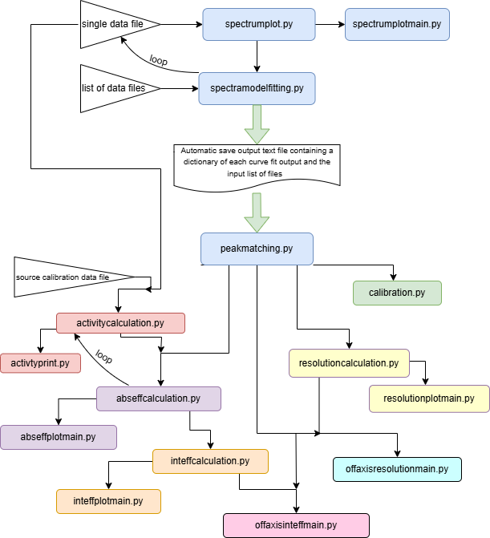

# HighEnergyDetectorsFinalCode - John Kavanagh - 24240176
## Final code submission for the High Energy Detector Lab assignment.

This project is for the purpose of calibration and classification of both solid state and scintilation high energy detectors. The code was tested with raw data from a Bismuth Germanate Detector (BGO) and a Cadmium Telluride detector (CdTe). However, it's design should facilitiate any detector of raw output file format '.spe' or '.mca'. Detailed info for each script operation presented below.

Calibration and characterisation outputs incorporated in this project include; 
* Individal spectral plotting
* Photopeak gaussian model fitting
* Calibration curve potting
* Resolution, absolute efficiency
* Intrinsic efficiency \
(the code can facilitiate a geometric factor based on a circlular detector or a rectangular detector)
* Off-axis response to resolution
* Off-axis response to intrinsic efficiency

Script Argument Naming Convensions: 
* raw datafiles from detectors must be of the format: \
  {source element (1st letter capital)}_{numerical angle}deg.Spe/mca \
  e.g. "Americium_0deg.Spe" \
  e.g. "Caesium_30deg.mca" 

  Figure 1: Flow Chart of Project Scripts

  

## spectrumplot.py
  Purpose: function stoage script
  
  Contains the functions required to;
  * extract the observation time and data from the datafile
  * extract the numerical spectral data from the datafile
  * plot a single spectrum

## spectrumplotmain.py
  Purpose: Plot the spectrum from a single datafile \
  Inputs:
  * filename of the single datafile
    
  Outputs:
  * plot of counts per second (cps) vs channel

## spectramodelfitting.py
  Purpose: iterating over each file in a list of files
  * take user input to identify the location of the photopeaks
  * plot the individual photopeaks (cps vs channel)
  * use curve_fit to apply a gaussian model to the peaks
  * automatically create and save a text file with the curve_fit output paramters and the list of files

  Inputs:
  * a list of filenames to be analysed \
e.g. Python spectramodelfitting.py "Americium_0deg.Spe" "Caesium_0deg.Spe" "Cobalt_0deg.Spe"

  Outputs:
  * text file with the curve_fit output paramters and the list of files
    
## peakmatching.py
  Purpose: function storage script

  Contains the functions required to:
  * read in the data text file from spectramodelfitting.py
  * extract the gaussian fit parameters (mean, sigma, amplitude) and their errors
  * sort the data in order of increasing energy
  * define a dictionary of known photopeaks for the sources
  * take user input to match the graphed peaks to a known photopeak energy

## calibration.py
  Purpose: 
  * plot channel vs energy for the photopeaks identified in peakmatching.py
  * fit a quadratic polynomial to the datapoints to test the linearity of the relationship

  Input:
  * text file from spectramodelfitting.py for the peaks deemed useful for calibration

  Output:
  * plot of channel vs energy with quadratic fit model

## resolutioncalculation.py
  Purpose: function storage script

  Contains the functions required to:
  * define a resolution vs energy relationship model equation
  * calculate resolution and its error from curve_fit output parameters

## resolutionplotmain.py
  Purpose: plot resolution vs energy with a relationsip model

  Input:
  * text file from spectramodelfitting.py

  Output:
  * plot resolution vs energy with a relationsip model

## activitycalculation.py
  Purpose: function storage script

  Contains the functions required to:
  * identify the source element for each peak and retrieve its half life
  * extract the date of calibration from its datafile
  * extract the date of observation from the raw detector datafile
  * calculate the present activity at the time of observation via the decay equation

## activtyprint.py
  Purpose: print the present activity for a single observation

  Input:
  * raw detector datafile filename
  * filename of the file containing the calibration data for the radioactive sources

  Output:
  * print of the present activity for the observation data & time of the input file

## abseffcalculation.py
  Purpose: function storage script

  Contains the functions required to:
  * call activitycalculation.py to get the activities for each of the peaks
  * call peakmatching.py to get the amplitudes from curve_fit
  * calculate absolute efficiency and its error

## abseffplotmain.py
  Purpose: plot absolute efficiency vs energy

  Input:
  * filename of the file containing the calibration data for the radioactive sources
  * text file from spectramodelfitting.py

  Output:
  * plot of absolute efficiency vs energy

## inteffcalculation.py
  Purpose: function storage script

  Contains the functions required to:
  * calculate geometric factor G \
    (G = ratio of solid angle subtended by the detector to total solid angle of the radiation sphere)\
    (code call calculate G for a rectangular/square or a circular detector aperture)
  * calculate intrinsic efficiecny = G * absoute efficiencies from abseffcalculation.py
  
## inteffplotmain.py
  Purpose: plot intrinsic efficiency vs energy with a quadratic model in the log scale

   Input:
  * filename of the file containing the calibration data for the radioactive sources
  * text file from spectramodelfitting.py

  Output:
  * plot of absolute efficiency vs energy
  * plot of a quadratic fit model to the data in the log scale

## offaxisresolutionmain.py
  Purpose: plot resolution vs angle \
  (note: this script also contains the function required to extract the angles from the filenames)

  Input: 
  * text file from spectramodelfitting.py

  Output:
  * plot of resolution vs angle

## offaxisinteffmain.py
  Purpose: plot intrinsic efficiency vs angle \
  (note: this script also contains the function required to extract the angles from the filenames)

  Input: 
  * text file from spectramodelfitting.py

  Output:
  * plot of intrinsic efficiency vs angle
